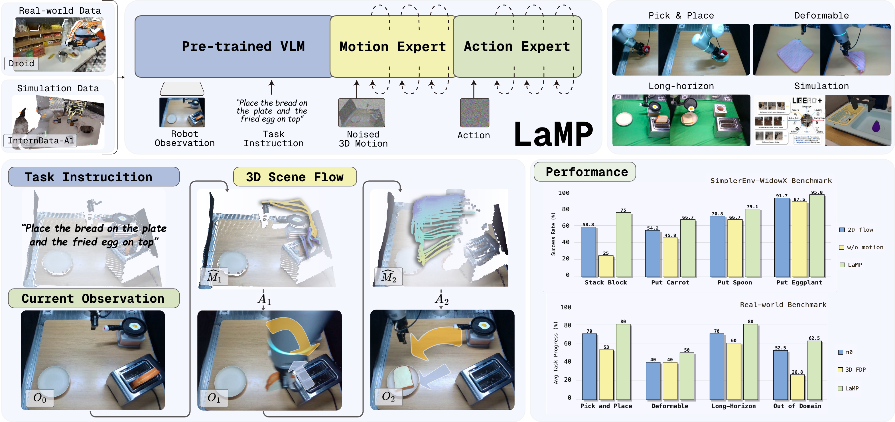
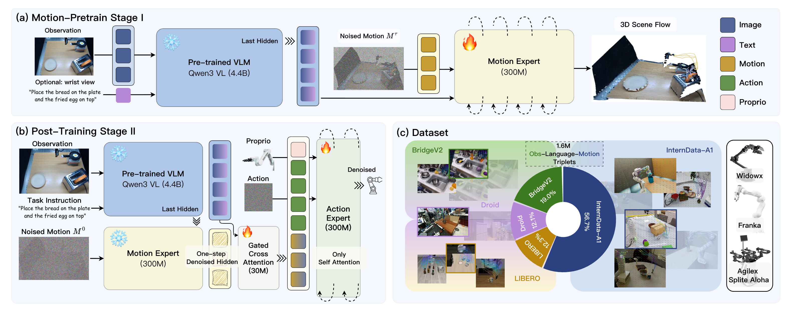

# LaMP: Learning Vision-Language-Action Policy with 3D Scene Flow as Latent Motion Prior

<div align="center">

[](https://arxiv.org/abs/2603.25399v2)
[](https://summerwxk.github.io/lamp-project-page/)
[](https://huggingface.co/summerwang11/LaMP-LIBERO)
[](https://huggingface.co/summerwang11/LaMP-Motion-Expert)
[](LICENSE)

</div>

<p align="center">
  
</p>

---

We introduce **LaMP**, a dual-expert vision-language-action framework that uses
3D scene flow as a latent motion prior and aligns a Motion Expert with an Action
Expert through gated cross-attention for geometry-aware robot manipulation.

## 🔥 Latest Updates

- [2026-06-20] Our paper has been accepted by ECCV 2026.
- [2026-03-26] We released the LaMP [paper](https://arxiv.org/abs/2603.25399)
  and [project page](https://summerwxk.github.io/lamp-project-page/).

## Contents

- [✨ Key Features](#-key-features)
- [🛠 Environment Setup](#-environment-setup)
- [🧩 Model Architecture](#-model-architecture)
- [💡 Training & Evaluation](#-training--evaluation)
- [🙏 Acknowledgements](#-acknowledgements)
- [✍️ Citation](#️-citation)

## ✨ Key Features

| Component | Description |
| --- | --- |
| **Latent 3D motion prior** | Task-conditioned 3D scene flow provides an explicit bridge between visual-language understanding and robot actions. |
| **Motion Expert** | A CogVideoX-based flow-matching expert predicts UVD scene flow from observations and task instructions. |
| **Motion Guidance** | Gated cross-attention injects latent motion features into the visual-language representation before action prediction. |
| **Action Expert** | A flow-matching policy generates 10-step, 7-DoF action chunks conditioned on visual-language and motion features. |
| **Two-stage learning** | Motion-prior learning is separated from action learning, allowing the frozen Motion Expert to guide downstream policy training. |

## 🛠 Environment Setup

### Step 1: Clone the Repository

```bash
git clone https://github.com/SummerWXK/LaMP.git
cd LaMP
```

### Step 2: Set Up the Python Environment

LaMP supports Linux, Python 3.10/3.11, CUDA, and bfloat16. Create and activate a
Conda environment, then install the dependencies and LaMP:

```bash
# Create the environment
conda create -n lamp python=3.11
conda activate lamp

# Install the required packages
pip install -r requirements.txt

# Install FlashAttention 2 with a version compatible with PyTorch and CUDA
pip install flash-attn --no-build-isolation

# Install LaMP
pip install -e .
```

FlashAttention 2 is used by the paper setup. PyTorch SDPA is available as a
compatibility fallback.

### Model Checkpoints

| Model | Contents | Usage |
| --- | --- | --- |
| [LaMP-LIBERO](https://huggingface.co/summerwang11/LaMP-LIBERO) | Complete Qwen3-VL, Motion Expert, Motion Guidance, and Action Expert policy | Inference and LIBERO evaluation |
| [LaMP-Motion-Expert](https://huggingface.co/summerwang11/LaMP-Motion-Expert) | `motion_head.*` weights | Stage 2 initialization and motion inference |

Download the checkpoints with the Hugging Face CLI:

```bash
hf download summerwang11/LaMP-LIBERO \
  --local-dir checkpoints/lamp-libero

hf download summerwang11/LaMP-Motion-Expert \
  --local-dir checkpoints/lamp-motion-expert
```

The release uses model-only PyTorch `.pt` state dictionaries. The loader calls
`torch.load(weights_only=True)` and checks checkpoint keys strictly.

### Data Preparation

Prepare the four LIBERO datasets in LeRobot v2.1 format under one root:

```text
data/libero_lerobot_v2/
├── libero_spatial_no_noops_lerobot/
├── libero_object_no_noops_lerobot/
├── libero_goal_no_noops_lerobot/
└── libero_10_no_noops_lerobot/
```

Each dataset must use LeRobot v2.1 format and contain `meta/info.json` with
`codebase_version` set to `v2.1`. LaMP uses the repository-bundled
`gr00t_lerobot` reader; the external `lerobot` Python package is not required.

The dataloader returns raw inputs:

- two PIL images: primary and wrist;
- a language instruction;
- `float32[8]` state;
- `float32[10, 7]` action chunk.

Image resizing, normalization, tokenization, dtype conversion, and device
transfer are handled by the policy framework.

## 🧩 Model Architecture

<p align="center">
  
</p>

Qwen3-VL encodes the two camera views and task instruction. The Motion Expert
predicts a latent UVD scene-flow representation, Motion Guidance fuses its hidden
features into the visual-language tokens through gated cross-attention, and the
Action Expert generates a 10-step action chunk with flow matching.

The checkpoint-compatible modules are `qwen_vl_interface`, `motion_head`,
`motion_guidance`, and `action_model`.

### Policy Inference

```python
import numpy as np
import torch
from PIL import Image

from starVLA import load_policy

policy = load_policy(
    "summerwang11/LaMP-LIBERO",
    device="cuda",
    dtype="bfloat16",
)

sample = {
    "image": [
        Image.open("primary.png").convert("RGB"),
        Image.open("wrist.png").convert("RGB"),
    ],
    "lang": "pick up the black bowl",
    "state": np.zeros(8, dtype=np.float32),
}

result = policy.predict_action(
    [sample],
    unnorm_key="libero",
    generator=torch.Generator(device="cuda").manual_seed(0),
    return_motion=False,
)

actions = result["actions"]  # [1, 10, 7]
```

`return_motion=True` additionally returns `motion_flow` with shape
`[B, 400, 32, 3]`. Local artifact directories and trusted local `.pt` files are
also accepted by `load_policy`.

## 💡 Training & Evaluation

### Stage 2 Training

The public Stage 2 configuration is
[`configs/lamp_stage2_libero_paper.yaml`](configs/lamp_stage2_libero_paper.yaml).

| Setting | Value |
| --- | --- |
| Hardware | 16 × H100 |
| Global batch size | 512 |
| Precision | bf16 |
| Optimizer | AdamW, betas `(0.9, 0.95)` |
| Learning rate | `1e-4` |
| Training steps | 15,000 |
| Trainable modules | Motion Guidance and Action Expert |
| Frozen modules | Qwen3-VL and Motion Expert |

Launch the paper-scale configuration with Accelerate and DeepSpeed ZeRO-2:

```bash
accelerate launch \
  --config_file starVLA/config/deepseeds/deepspeed_zero2.yaml \
  -m starVLA.training.train_lamp_action \
  --config_yaml configs/lamp_stage2_libero_paper.yaml
```

For a single-GPU smoke run:

```bash
python -m starVLA.training.train_lamp_action \
  --config_yaml configs/lamp_stage2_libero_paper.yaml \
  --trainer.enforce_paper_hardware false \
  --trainer.max_train_steps 20 \
  --datasets.vla_data.per_device_batch_size 1
```

Training checkpoints contain model weights, configuration, and normalization
statistics. Optimizer and scheduler states are not saved.

### LIBERO Evaluation

For setup and evaluation details, refer to StarVLA's
[`examples/LIBERO`](https://github.com/starVLA/starVLA/tree/starVLA/examples/LIBERO).

### Results

The released 30k checkpoint achieves an average success rate of **98.3%** over
2,000 LIBERO episodes.

| Suite | Successes | Episodes | Success rate |
| --- | ---: | ---: | ---: |
| LIBERO-Spatial | 497 | 500 | 99.4% |
| LIBERO-Object | 499 | 500 | 99.8% |
| LIBERO-Goal | 487 | 500 | 97.4% |
| LIBERO-10 | 483 | 500 | 96.6% |
| **Average** | **1966** | **2000** | **98.3%** |

## TODO

The following features are planned for future releases:

- [x] LaMP policy and Motion Expert checkpoints.
- [x] Stage 2 training and LIBERO evaluation.
- [ ] Release Stage 1 Motion Expert training code.
- [ ] Release evaluation code for additional simulation benchmarks.

## 🙏 Acknowledgements

We thank the authors of [Qwen3-VL](https://github.com/QwenLM/Qwen3-VL),
[StarVLA](https://github.com/starVLA/starVLA), and
[TraceGen](https://tracegen.github.io/) for their excellent open-source projects.

## ✍️ Citation

If you find LaMP useful, please cite:

```bibtex
@inproceedings{wang2026lamp,
  title={LaMP: Learning Vision-Language-Action Policy with 3D Scene Flow as Latent Motion Prior},
  author={Wang, Xinkai and Wang, Chenyi and Xu, Yifu and Ye, Mingzhe and Zhang, Fucheng and Tian, Jialin and Zhan, Xinyu and Zhu, Lifeng and Lu, Cewu and Yang, Lixin},
  booktitle={European Conference on Computer Vision (ECCV)},
  year={2026}
}
```
